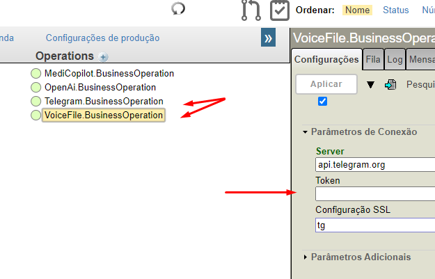
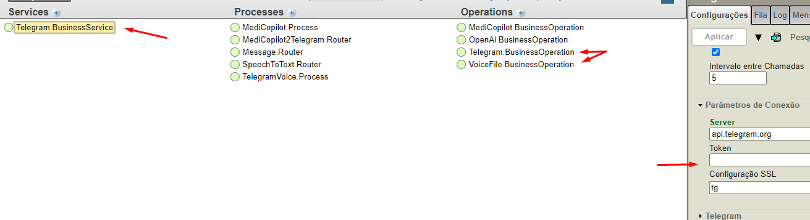
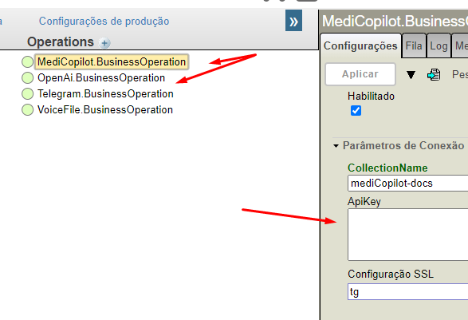
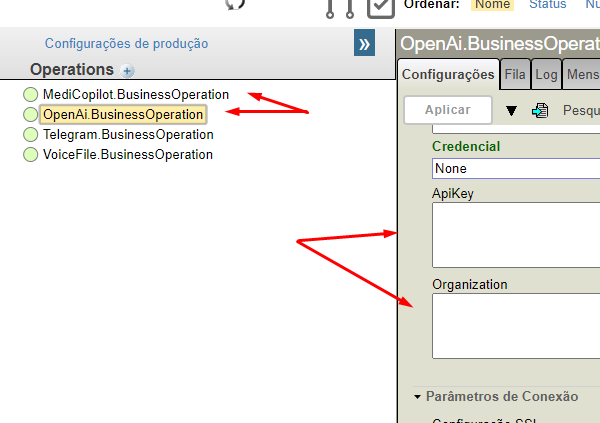

 [](https://openexchange.intersystems.com/package/intersystems-iris-dev-template)
 [](https://community.objectscriptquality.com/dashboard?id=intersystems_iris_community%2Fintersystems-iris-dev-template)
 [](https://community.objectscriptquality.com/dashboard?id=intersystems_iris_community%2Fintersystems-iris-dev-template)

[](LICENSE)

- [IRIS-MediCoPilot](#iris-medicopilot)
  - [Motivation](#motivation)
  - [How it works?](#how-it-works)
  - [Prerequisites](#prerequisites)
  - [Installation](#installation)
    - [Setting a LLM API key](#setting-a-llm-api-key)
    - [Docker](#docker)
    - [IPM](#ipm)
- [Limitations](#limitations)
- [Future work](#future-work)
- [Credits](#credits)
- [Dream team](#dream-team)


# IRIS-MediCoPilot

	

## Motivation

Our project, **Iris-MediCoPilot**, is designed to optimize patient clinical outcomes by reducing hospitalization time and supporting the development of resident and novice physicians. Additionally, it contributes to reducing financial waste in the healthcare system by improving the monitoring of pregnant patients, thereby decreasing risks and enhancing their safety.

To achieve this, patients can conveniently describe their symptoms through a user-friendly Telegram bot. The project then leverages a comprehensive medical database to analyze the information. Additionally, the bot strategically asks clarifying questions to gather further details and refine the potential diagnosis. If the **Iris-MediCoPilot** identifies a potential health risk, it will advise the patient to seek medical attention at a hospital. Furthermore, the conversation history is automatically forwarded to a doctor acting as a "co-pilot" or "sidekick," providing valuable insights to support physician decision-making.


## How it works?

This project leverages cutting-edge technologies to streamline patient care and support physicians. Here's a breakdown of the process:

1. User-Friendly Patient Interaction:
  Patients conveniently report symptoms through a Telegram bot.

2. Intelligent Symptom Analysis:
  The system utilizes a vector search database to analyze the reported symptoms. This database efficiently retrieves similar cases based on underlying semantic relationships.
  RAG (Retrieval-Augmented Generation) technology empowers the system to access and integrate relevant medical knowledge from a supplementary knowledge base.
  Prompt engineering techniques, including role-playing and prompt chaining, guide Large Language Models (LLMs) like ChatGPT 3.5 to ask clarifying questions and delve deeper into the patient's situation.

3. Refining the Diagnosis:
  LLMs analyze the extracted features from the vector search and the retrieved medical knowledge.
  To compensate for the LLM's potential lack of specialized medical knowledge, the system provides contextually embedded information to guide their responses.
  In this initial version, synthetic data based on common pregnancy risks and diseases is used to train the LLMs.

4. Risk Assessment and Recommendation:
  Based on the analysis, the system assesses potential health risks.
  If a risk is identified, the patient is advised to seek medical attention at a hospital.
  The conversation history is automatically forwarded to a doctor acting as a "co-pilot" or "sidekick" to provide additional insights and support their decision-making.
  This combined approach aims to improve the accuracy of diagnoses, reduce unnecessary hospitalizations, and enhance patient care.

## Prerequisites

Make sure you have [git](https://git-scm.com/book/en/v2/Getting-Started-Installing-Git) and [Docker desktop](https://www.docker.com/products/docker-desktop) installed.

## Installation 

### Setting a LLM API key

To utilize the Large Language Model (LLM) service, you'll need an API key. Currently, the project supports OpenAI's LLM service.

[Obtain your OpenAI API key by creating an account on their platform](https://openai.com/).

#### Configuring Environment Variables:

Environment variables are used to store sensitive information like API keys and tokens. These variables need to be set before building the Docker image.

There are two ways to configure these variables:

When launching the Docker container, you can set the `OPENAI_KEY` and `TELEGRAM_TOKEN` the environment variables using the -e flag:

```bash
# OpenAI API key
export OPENAI_KEY=$OPENAI_KEY
# Telegram bot Token
export TELEGRAM_TOKEN=$TELEGRAM_TOKEN
```

### Docker

Clone/git pull the repo into any local directory

```
$ git clone https://github.com/musketeers-br/iris-medicopilot.git 
```

Open the terminal in this directory and run:

```
$ docker-compose build

$ docker-compose up -d
```

### IPM

Open IRIS installation with IPM client installed. Call in any namespace:

```objectscript
USER>zpm "install iris-medicopilot"

```

Or call the following for installing programmatically:

```objectscript
set sc=$zpm("install iris-medicopilot")
```

### How to Run the Service

This section outlines the steps to set up and run the service in production.

1. Configuration:
  - Telegram Token:
    - Obtain your Telegram bot's token from the BotFather (https://telegram.me/BotFather).
    - Add this token to the following configurations:
      - Telegram.BusinessService
      - Telegram.BusinessOperation
      - VoiceFile.BusinessOperation

  	
  	

  - OpenAI API Key and Organization ID:
    -  Create an account on OpenAI (https://openai.com/) and obtain your API key.
    - Retrieve your organization ID from the OpenAI platform.
    - Initialize these credentials with:
      - OpenAi.BusinessOperation

  	
  	

  - Environment Variables (Optional):
    - Alternatively, you can set the necessary [environment variables (TELEGRAM_TOKEN, OPENAI_KEY) to avoid manual configuration](#configuring-environment-variables).

2. Starting the Service:
  Once configuration is complete, start the production. 


# Limitations

As with any new technology, there are limitations to consider:

- Experimental Phase: 
  The project is currently undergoing testing and refinement. It's important to acknowledge that the system might generate inaccurate or unexpected results. Our primary focus at this stage is to validate the core concept of using LLMs to aid healthcare professionals.

- Limited Data Complexity: 
  Up to this point, the project has primarily focused on working with basic and well-defined structured data. Integrating more intricate and nuanced data types requires further development.

- Data Privacy and Security: 
  This initial version does not comprehensively address crucial aspects of data privacy and security. These are critical considerations that will be addressed in future research and development phases.

We are committed to responsible development and will prioritize these limitations in future iterations of the project.

# Credits

This application uses:
- [Telegram-adapter](https://openexchange.intersystems.com/package/Telegram-adapter) by [Nikolay Soloviev](https://openexchange.intersystems.com/user/Nikolay%20Solovyev/PdgTNFsHyQu1qL02CS4BfFYIs)
- [Iris-OpenAI](https://openexchange.intersystems.com/package/iris-openai) adapter by [Kurro Lopez](https://openexchange.intersystems.com/user/Francisco%20L%C3%B3pez/n8nIarmmcBVMySIjS3ukc2Mp9w)
- [Langchain-Iris](https://openexchange.intersystems.com/package/langchain-iris) by [Dmitry Maslennikov](https://openexchange.intersystems.com/user/Dmitry%20Maslennikov/YpNBvnDkky3FetRt6rPnhxRjjwM)

# Dream team

* [José Roberto Pereira](https://community.intersystems.com/user/jos%C3%A9-roberto-pereira-0)
* [Henry Pereira](https://community.intersystems.com/user/henry-pereira)
* [Henrique Dias](https://community.intersystems.com/user/henrique-dias-2)
